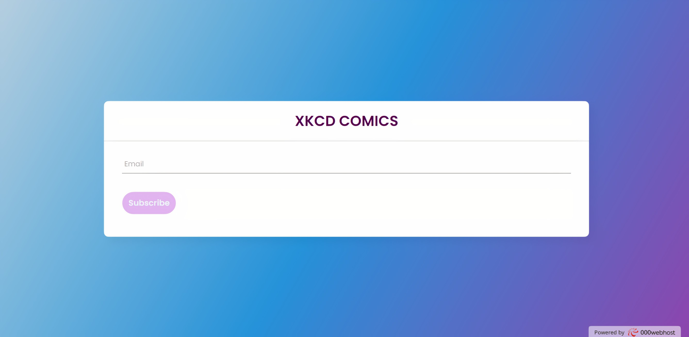

# **XKCD Challenge**

>**Project URL**

[XKCD COMICS CHALLENGE](https://xkcdcomics-challenge.000webhostapp.com/)

___

>**Description of XKCD challenge project.**

This project is created using PHP as the main language. This project asks the users to enter their email address. An auto generated email is sent to the registered email id for verification. Once the user clicks on the link in the email their email address is verified and they start receiving random XKCD comics through mail every 5 minutes. The mail contains the comic as inline as well as attachment. The mail also contains an unsubscribe link. If anytime the user wishes to unsubscribe from receiving the comics, they can click the unsubscribe link in the email and they will stop receiving mails. They can subscribe again using the same website of they wish to. 

The code is thoroughly checked for any cross site scripting as well as sql injections. So the details of the users are safe.
___

## **Table of contents**

- [Technology used](#Technology-used)
- [Description of the Files](#Description-of-the-Files)
    - [index.php file](#index-file)
    - [style.css file](#style-file)
    - [Database Folder](#Database-Folder)
    - [Mails Folder](#mails-folder)
    - [Curl Folder](#curl-folder)
    - [verified.html file](#verified-file)
    - [verify.css file](#verify-stylesheet-file)
    - [unsubscribe.html file](#unsubscribe-file)
    - [unsubscribe.css file](#unsubscribe-stylesheet-file)

# **Technology used**
- PHP: This is main programming language used throughout the script.
- HTML & CSS: It is used for designing the website.
- CURL: This is used for downloading random XKCD comic image.
- SendGrid: SendGrid API is used for sending emails to the user.

# **Description of the Files**
# **index file**
- It contains a title **XKCD Challenge**.
- There is a basic form which asks the user to enter their email address and a verfication email will be sent to the registered id.

# **style file** 
- The style.css file conatins all the css required for the index.php file.

# **Database Folder**
## **config.php file**
- It contains the basic configuration of the database.

## **validation.php file**
- This is the file for email verification and insertion.
- If the email is empty then an error is printed
- If the email is already present in the database and is verified (status 1) then error is printed. 
- If the email is already present in the database but is unverified (status 0) then an email containing the verification link is sent to the registered email-id.
- If there is no error then the email is entered into the database and an email containing the verification link is sent to the registered email-id.
- A token for subscribing and unsubscribing is created and added in the database. 

## **activate.php file**
- When the user clicks the link sent in their email for verification, it changes the status in the database to 1 for the respective user.

## **unsubcribe.php file**
- When the user clicks on the unsubscribe link present in the email, this file deletes the user from the database. 

## **secret_sample file**
- It contains the sample data for actual secret.php file which contains all the sensitive information like API keys and database credentials.

# **mails folder**
## **verify_mail.php file**
- This file is for sending confirmation email to anyone who registers on the website.
- The mail is sent using sendgrid api and curl.
The mail contains a link which when clicked will verify the email.

## **sendmails.php file**
- This file sends ab email containing random xkcd comics to all the registered users who have verified their email.
- The mail is sent using sendgrid api and curl.
The mail contains comics as inline as well as attachments and an unsubscribe link.

# **curl folder**
## **imageDownload.php file**
- This file downloads a random XKCD comics everytime it is executed.
- It uses curl to download image. 
- The API contains information in json format.
- The information is decoded using json_decode() and the url for each comic is extracted and the image is downloaded.

# **verified file**
- This is a confirmation page that shows the user that their email is successfully verified

# **verify stylesheet file**
- This is the stylesheet for verified.html.

# **unsubscribe file**
- This is a confirmation page that shows the user that their email is successfully unsubscribed.

# **unsubscribe stylesheet file**
- This is the stylesheet for unsubcribe.html.

___

 [Table of contents](#Table-of-contents)

 [Back to the top](#XKCD-Challenge) 

